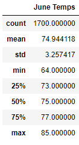
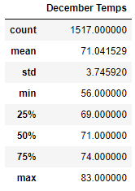

# Surfs Up Analysis

## Overview

The purpose of this analysis was to dive into temperatures on Oahu in June and December to determine whether a surf and ice cream shop business would be sustainable year-round.

## Results

 

- December temperatures vary slightly more than June temperatures, as shown by the higher standard deviation in December
- December is roughly 4 degrees cooler than June on average
  - The maximum temperatures are the most similar, while minimum temperatures have a bigger gap
- The difference between maximum and minimum temperature is very similar for June (22 degrees) and December (24 degrees)

## Summary

The results of this analysis point to a surf and ice cream shop business being successful at all times of the year. While December is a little bit colder than June, the difference is not big enough that it should cause a significant disruption in outdoor activities. In particular, the maximum temperature in December is only 2 degrees cooler than that of June; since the warmest part of the day is the time such a business would be most active, this difference should not be the difference between being profitable and losing money.

An additional query that could give us more information to make this decision could be a year-over-year analysis. If the difference between June and December is narrowing as the years go on, there is even more reason to believe this business would thrive year-round. However, if the gap is widening, that may be cause for concern. Another possible query could be comparing temperatures at different times of day. If the main difference in average temperature between June and December occurs overnight while the daytime temperatures remain similar, that difference is largely irrelevant in determining the success of business.
